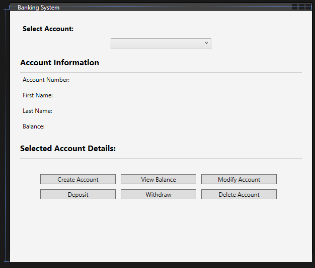
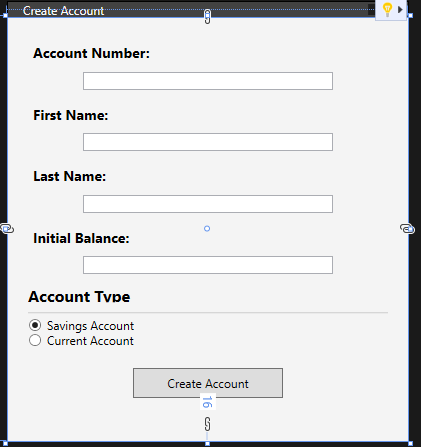
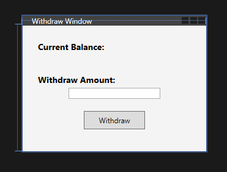
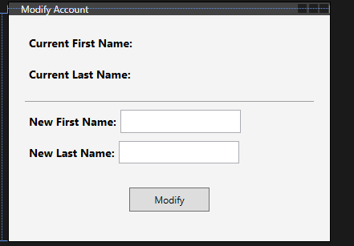

# Lab 14: OOP using a GUI

We are going to create a new C# Windows Platform Application give it the project name `BankingApp_Wpf`.


## 1: Modifying MainWindow.xaml
1. The following is layout will be followed: 

<div align=center>


</div>

2. Firstly you need modify the <Window ..> tag so that the Title attribute says Banking System,  and the height and width are 500 and 600. 

    ```xml
    <Window x:Class="BankingApp_Wpf.MainWindow"
            xmlns="http://schemas.microsoft.com/winfx/2006/xaml/presentation"
            xmlns:x="http://schemas.microsoft.com/winfx/2006/xaml"
            Title="Banking System" Height="500" Width="600">
    ```

3. Next modify the Grid tag like the following so that you have a new background colour:

    ```xml
    <Grid Background="#F4F4F4" Margin="0,0,0,-16">
    ```

4. The Banking App will have dropdown box that will allow the user to select from a list of accounts. Using a `StackPanel`, which arranges child elements into a single line that can be oriented horizontally or vertically, add a Label and ComboBox like so:

    ```xml
    <Grid Background="#F4F4F4" Margin="0,0,0,-16">
        <StackPanel Margin="20,20,20,7">
            <Label Content="Select Account:" FontWeight="Bold" FontSize="14"/>
            <ComboBox x:Name="accountComboBox" Width="200" Margin="0,5,0,15" SelectionChanged="AccountComboBox_SelectionChanged"/>
    ```
    <div align=center>

    

    </div>

5. Following on from this we will need to create a separation using a border for the next section of this form, which will be the account information.

    ```xml
    <Border BorderBrush="#CCCCCC" BorderThickness="0,0,0,1" Padding="0,0,0,10">
                    <TextBlock Text="Account Information" FontWeight="Bold" FontSize="16"/>
                </Border>
    ```

    <div align=center>

    

    <div>

6. Now we need to create a new StackPanel to house our **Account Number**, **First** \& **Last name**, and **account balanace**:

    ```xml
    <StackPanel Margin="0,0,0,15">
        <StackPanel Orientation="Horizontal" Margin="0,0,0,5">
            <Label Content="Account Number:"/>
            <Label x:Name="accountNumberLabel" Width="200" Margin="10,0,0,0"/>
        </StackPanel>
        <StackPanel Orientation="Horizontal" Margin="0,0,0,5">
            <Label Content="First Name:"/>
            <Label x:Name="firstNameLabel" Width="200" Margin="10,0,0,0"/>
        </StackPanel>
        <StackPanel Orientation="Horizontal" Margin="0,0,0,5">
            <Label Content="Last Name:"/>
            <Label x:Name="lastNameLabel" Width="200" Margin="10,0,0,0"/>
        </StackPanel>
        <StackPanel Orientation="Horizontal" Margin="0,0,0,5">
            <Label Content="Balance:"/>
            <Label x:Name="balanceLabel" Width="200" Margin="10,0,0,0"/>
        </StackPanel>
    </StackPanel>
    ```

    <div align=center>

    

    <div>

7. Penultimately, some control buttons need to be added so the user can interact with accounts:

    ```xml
    <Border BorderBrush="#CCCCCC" BorderThickness="0,0,0,1" Padding="0,0,0,10">
                    <TextBlock Text="Selected Account Details:" FontWeight="Bold" FontSize="16"/>
                </Border>

                <StackPanel Orientation="Horizontal" HorizontalAlignment="Center">
                    <Button Content="Create Account" Width="150" Click="CreateAccountButton_Click" Margin="0,0,10,0"/>
                    <Button Content="View Balance" Width="150" Click="ViewBalanceButton_Click" Margin="0,0,10,0"/>
                    <Button Content="Modify Account" Width="150" Click="ModifyAccountButton_Click" Margin="0,0,10,0"/>
                </StackPanel>

                <StackPanel Orientation="Horizontal" HorizontalAlignment="Center" Margin="0,10,0,0">
                    <Button Content="Deposit" Width="150" Click="DepositButton_Click" Margin="0,0,10,0"/>
                    <Button Content="Withdraw" Width="150" Click="WithdrawButton_Click" Margin="0,0,10,0"/>
                    <Button Content="Delete Account" Width="150" Click="DeleteAccountButton_Click" Margin="0,0,10,0"/>
                </StackPanel>        
    ```
**Output:**

<div align=center>



</div>

8. Lastly, add a `TextBlock` for verbose feedback to the user:

    ```xml
    <TextBlock x:Name="resultTextBlock" TextWrapping="Wrap" Height="34" RenderTransformOrigin="0.5,0.5" Width="548">
                </TextBlock>
            </StackPanel>
        </Grid>
    </Window>
    ```

<details>
<summary>Show Full Code...</summary>

```xml
<Window x:Class="BankingApp_Wpf.MainWindow"
        xmlns="http://schemas.microsoft.com/winfx/2006/xaml/presentation"
        xmlns:x="http://schemas.microsoft.com/winfx/2006/xaml"
        Title="Banking System" Height="500" Width="600">
    <Grid Background="#F4F4F4" Margin="0,0,0,-16">
        <StackPanel Margin="20,20,20,7">
            <Label Content="Select Account:" FontWeight="Bold" FontSize="14"/>
            <ComboBox x:Name="accountComboBox" Width="200" Margin="0,5,0,15" SelectionChanged="AccountComboBox_SelectionChanged"/>

            <Border BorderBrush="#CCCCCC" BorderThickness="0,0,0,1" Padding="0,0,0,10">
                <TextBlock Text="Account Information" FontWeight="Bold" FontSize="16"/>
            </Border>

            <StackPanel Margin="0,0,0,15">
                <StackPanel Orientation="Horizontal" Margin="0,0,0,5">
                    <Label Content="Account Number:"/>
                    <Label x:Name="accountNumberLabel" Width="200" Margin="10,0,0,0"/>
                </StackPanel>
                <StackPanel Orientation="Horizontal" Margin="0,0,0,5">
                    <Label Content="First Name:"/>
                    <Label x:Name="firstNameLabel" Width="200" Margin="10,0,0,0"/>
                </StackPanel>
                <StackPanel Orientation="Horizontal" Margin="0,0,0,5">
                    <Label Content="Last Name:"/>
                    <Label x:Name="lastNameLabel" Width="200" Margin="10,0,0,0"/>
                </StackPanel>
                <StackPanel Orientation="Horizontal" Margin="0,0,0,5">
                    <Label Content="Balance:"/>
                    <Label x:Name="balanceLabel" Width="200" Margin="10,0,0,0"/>
                </StackPanel>
            </StackPanel>

            <Border BorderBrush="#CCCCCC" BorderThickness="0,0,0,1" Padding="0,0,0,10">
                <TextBlock Text="Selected Account Details:" FontWeight="Bold" FontSize="16"/>
            </Border>

            <StackPanel Orientation="Horizontal" HorizontalAlignment="Center">
                <Button Content="Create Account" Width="150" Click="CreateAccountButton_Click" Margin="0,0,10,0"/>
                <Button Content="View Balance" Width="150" Click="ViewBalanceButton_Click" Margin="0,0,10,0"/>
                <Button Content="Modify Account" Width="150" Click="ModifyAccountButton_Click" Margin="0,0,10,0"/>
            </StackPanel>

            <StackPanel Orientation="Horizontal" HorizontalAlignment="Center" Margin="0,10,0,0">
                <Button Content="Deposit" Width="150" Click="DepositButton_Click" Margin="0,0,10,0"/>
                <Button Content="Withdraw" Width="150" Click="WithdrawButton_Click" Margin="0,0,10,0"/>
                <Button Content="Delete Account" Width="150" Click="DeleteAccountButton_Click" Margin="0,0,10,0"/>
            </StackPanel>
            <TextBlock x:Name="resultTextBlock" TextWrapping="Wrap" Height="34" RenderTransformOrigin="0.5,0.5" Width="548">
            </TextBlock>
        </StackPanel>
    </Grid>
</Window>
```
</details>

>**Note:**
>>We will revist the `MainWindow.xaml.cs` later as we need to setup a **base** class and **derived** classes

## n: Creating the Account `abstract` class:

An `abstract` class is a class in object-oriented programming that cannot be instantiated on its own and is meant to be **subclassed** by other classes. It often contains abstract methods, which are methods without a body, intended to be implemented by the subclasses. Abstract classes can also have regular methods with an implementation.

9. Add a new `Windows Presentation Foundation window` by doing the following:


10. In the code below, the `Account` class is declared as an `abstract` class. Reproduce: 

<details>
<summary>Show Code:</summary>

```csharp
/// <summary>
/// Represents an abstract class for various types of accounts in a banking system.
/// </summary>
public abstract class Account
{
    /// <summary>
    /// Gets or sets the account number.
    /// </summary>
    public int AccountNumber { get; set; }

    /// <summary>
    /// Gets or sets the first name of the account holder.
    /// </summary>
    public string FirstName { get; set; }

    /// <summary>
    /// Gets or sets the last name of the account holder.
    /// </summary>
    public string LastName { get; set; }

    /// <summary>
    /// Gets or sets the balance of the account.
    /// </summary>
    protected double Balance { get; set; }

    /// <summary>
    /// Creates a new account with the specified details.
    /// </summary>
    /// <param name="accountNumber">The account number.</param>
    /// <param name="firstName">The first name of the account holder.</param>
    /// <param name="lastName">The last name of the account holder.</param>
    public Account(int accountNumber, string firstName, string lastName)
    {
        AccountNumber = accountNumber;
        FirstName = firstName;
        LastName = lastName;
        Balance = 0;
    }

    /// <summary>
    /// Deposits the specified amount into the account.
    /// </summary>
    /// <param name="amount">The amount to be deposited.</param>
    public abstract void Deposit(double amount);

    /// <summary>
    /// Withdraws the specified amount from the account.
    /// </summary>
    /// <param name="amount">The amount to be withdrawn.</param>
    public abstract void Withdraw(double amount);

    /// <summary>
    /// Displays the current balance of the account.
    /// </summary>
    public abstract void DisplayBalance();

    /// <summary>
    /// Modifies the account details.
    /// </summary>
    /// <param name="firstName">The new first name of the account holder.</param>
    /// <param name="lastName">The new last name of the account holder.</param>
    public void ModifyAccount(string firstName, string lastName)
    {
        FirstName = firstName;
        LastName = lastName;
    }

    /// <summary>
    /// Deletes the account.
    /// </summary>
    public void DeleteAccount()
    {
        // Additional logic for account deletion, if needed
        Console.WriteLine($"Account {AccountNumber} deleted.");
    }
}
```

</details>

- Let's break down its key aspects,:
    - `Deposit`, `Withdraw`, and `DisplayBalance` are abstract methods.
    - They are declared in the abstract class but lack an implementation (i.e., no method body). Subclasses (like SavingsAccount and CurrentAccount) must provide concrete implementations for these methods.   
    - The `<summary>` tags provide a brief description of the purpose of the class and each method.
    - The `<param>` tags describe the parameters of each method, specifying what each parameter represents.
- These comments follow the XML documentation format, which is commonly used in C# to provide inline documentation. This format supports tools like IntelliSense to display information about classes and methods as developers use them.

    >**Summary:**
    >> The concept of abstraction is highlighted by the fact that the Account class provides a high-level interface for various types of accounts without specifying the exact details of how depositing, withdrawing, or displaying balance is done. The details are left to the subclasses to define.

## 2: Creating the `SavingsAccount` and `CurrentAccount`  through inheritance of Account class `abstract` class:

11. You now need to add two new classes one called, `SavingsAccount` and the other `CurrentAccount`, like you did before

- The `SavingsAccount` and `CurrentAccount` classes **inherit** from the `Account` class. By doing so, they are obligated to implement the abstract methods defined in the `Account` class:

 - `Deposit()`
 - `Withdraw()`
 - `DisplayBalance()`

12. Open the `SavingsAccounts.cs` file and reproduce the following:

    ```csharp
     public class SavingsAccount : Account
    {
        // Constructor
        public SavingsAccount(int accountNumber, string firstName, string lastName, double balance)
            : base(accountNumber, firstName, lastName){
        }

        // Implement abstract methods
        public override void Deposit(double amount)
        {
            // Implement deposit logic
            Balance += amount;
        }

        public override void Withdraw(double amount)
        {
            // Implement withdrawal logic
            if (Balance >= amount)
            {
                Balance -= amount;
            }
            else
            {
                Console.WriteLine("Insufficient funds for withdrawal.");
            }
        }

        public override double GetBalance()
        {
            return Balance;
        }
    }
    ```

13. Open the `CurrentAccounts.cs` file and reproduce the following:
    ```csharp
    public class CurrentAccount : Account
    {
        // Constructor
        public CurrentAccount(int accountNumber, string firstName, string lastName, double balance)
            : base(accountNumber, firstName, lastName){
        }

        // Implement abstract methods
        public override void Deposit(double amount)
        {
            // Implement deposit logic for current account
            Balance += amount;
        }

        public override void Withdraw(double amount)
        {
            // Implement withdrawal logic for current account
            if (Balance >= amount)
            {
                Balance -= amount;
            }
            else
            {
                Console.WriteLine("Insufficient funds for withdrawal.");
            }
        }

        public override double GetBalance()
        {
            return Balance;
        }
    }
    ```

- Code that uses the `Account` class can work with any **derived** class (e.g., `SavingsAccount` or `CurrentAccount`) without knowing the specific details of each account type. This is an example of **polymorphism**, where different types of objects (subclasses) can be treated as instances of the base class.

- The **properties** `AccountNumber`, `FirstName`, and `LastName` are directly accessible in these **derived** classes, allowing you to use the account information in the implementation.

>**Summary:**
>> - **Abstract** classes can define a contract that their subclasses must follow. In this case, any class representing an account must implement the methods specified in the `Account` class.
>>
>> - By using an abstract class, you provide a common structure and interface for different types of accounts, allowing for code reusability and making it easier to extend the system with new account types in the future.
>>
>> - Now, when you create instances of `SavingsAccount` or `CurrentAccount`, you can set and retrieve the account details through the properties inherited from the `Account` base class.

## 3: Creating the `CreateAccount`, `ModifyWindow`, `DepositWindow`, and `WithdrawWindow` classes:

14. You need to create the following `Windows Presentation Foundation window`, this generates two files the `filename.xaml` and a child file `filename.xaml.cs`:

- Make the following `CreateAccount`, `ModifyWindow`, `DepositWindow`, and `WithdrawWindow`


15. Once that is done, modify the `CreateAccount.xaml`. 

 - Using the elements `Grid`, `StackPanel`, `Label`, `Texbox`, `Button` the following will be created:
    - Account Number
    - FirstName
    - Last Name
    - Initial Balance
    - Account Type Radio buttons:
        - Saving Account
        - Current Account
    - A submit button

    ```xml
    <Window x:Class="BankingApp_Wpf.CreateAccount"
            xmlns="http://schemas.microsoft.com/winfx/2006/xaml/presentation"
            xmlns:x="http://schemas.microsoft.com/winfx/2006/xaml"
            Title="Create Account" Height="423" Width="400">
        <Grid Background="#F4F4F4" Margin="0,0,0,-16">
            <StackPanel Margin="20">
                <Label Content="Account Number:" FontWeight="Bold" FontSize="14"/>
                <TextBox x:Name="accountNumberTextBox" Width="250" Margin="0,5,0,10"/>

                <Label Content="First Name:" FontWeight="Bold" FontSize="14"/>
                <TextBox x:Name="firstNameTextBox" Width="250" Margin="0,5,0,10"/>

                <Label Content="Last Name:" FontWeight="Bold" FontSize="14"/>
                <TextBox x:Name="lastNameTextBox" Width="250" Margin="0,5,0,10"/>

                <Label Content="Initial Balance:" FontWeight="Bold" FontSize="14"/>
                <TextBox x:Name="initialBalanceTextBox" Width="250" Margin="0,5,0,10"/>

                <Border BorderBrush="#CCCCCC" BorderThickness="0,0,0,1" Padding="0,0,0,10" Height="29">
                    <TextBlock Text="Account Type" FontWeight="Bold" FontSize="16"/>
                </Border>

                <StackPanel Margin="0,5,0,10">
                    <RadioButton x:Name="savingsRadioButton" Content="Savings Account" IsChecked="True"/>
                    <RadioButton x:Name="currentRadioButton" Content="Current Account"/>
                </StackPanel>

                <Button Content="Create Account" Width="150" Height="30" Click="CreateAccountButton_Click" Margin="0,10,0,0"/>
            </StackPanel>
        </Grid>
    </Window>
    ```

    <div align=center>

    

    </div>

16. Once that is done, you can wirte the C# program for `CreateAccount.xaml.cs`. 

    ```csharp
    /// <summary>
    /// Interaction logic for CreateAccount.xaml
    /// </summary>
    public partial class CreateAccount : Window
    {
        public List<int> AccountNumbers { get; set; }
        public bool IsSavingsAccount { get; private set; }

        public CreateAccount()
        {
            InitializeComponent();
        }

        private void CreateAccountButton_Click(object sender, RoutedEventArgs e)
        {
            int newAccountNumber;
            if (!int.TryParse(accountNumberTextBox.Text, out newAccountNumber))
            {
                MessageBox.Show("Invalid account number. Please enter a valid integer.");
                return;
            }

            if (AccountNumbers.Contains(newAccountNumber))
            {
                MessageBox.Show("Account number already exists. Please choose a different account number.");
                return;
            }

            // Set IsSavingsAccount based on radio button selection
            IsSavingsAccount = savingsRadioButton.IsChecked ?? false;

            DialogResult = true; // Set DialogResult to true to indicate successful account creation
            Close();
        }
    }
    ```

17. Once that is done, modify the `DepositWindow.xaml`. 

 - Using the elements `Grid`, `StackPanel`, `Label`, `Texbox`, `Button` the following will be created:
    - Deposit Title
    - Input box
    - A submit button

```xml
<Window x:Class="BankingApp_Wpf.DepositWindow"
        xmlns="http://schemas.microsoft.com/winfx/2006/xaml/presentation"
        xmlns:x="http://schemas.microsoft.com/winfx/2006/xaml"
        Title="Deposit Window" Height="155" Width="300">
    <Grid Background="#F4F4F4" Margin="0,0,0,-16">
        <StackPanel Margin="20">
            <Label Content="Deposit Amount:" FontWeight="Bold" FontSize="14"/>
            <TextBox x:Name="depositAmountTextBox" Width="150" Margin="0,5,0,10"/>

            <Button Content="Deposit" Width="100" Height="30" Click="DepositButton_Click" Margin="0,10,0,0"/>
        </StackPanel>
    </Grid>
</Window>
```

<div align=center>


</div>

18. Once that is done, you can wirte the C# program for `DepositWindow.xaml.cs`.

```csharp
public partial class DepositWindow : Window
{
    public double DepositAmount { get; private set; }

    public DepositWindow()
    {
        InitializeComponent();

        
    }

    private void DepositButton_Click(object sender, RoutedEventArgs e)
    {
        if (double.TryParse(depositAmountTextBox.Text, out double amount))
        {
            DepositAmount = amount;
            DialogResult = true; // Set DialogResult to true to indicate successful deposit
            Close();
        }
        else
        {
            MessageBox.Show("Invalid amount. Please enter a valid number.");
        }
    }
}
```

19. Once that is done, modify the `WithdrawWindow.xaml`.   

 - Using the elements `Grid`, `StackPanel`, `Label`, `Texbox`, `Button` the following will be created:
    - Current Balance Label 
    - Balance Labe
    - Withdraw Amount Label and Input box
    - A submit button

```xml
<Window x:Class="BankingApp_Wpf.WithdrawWindow"
        xmlns="http://schemas.microsoft.com/winfx/2006/xaml/presentation"
        xmlns:x="http://schemas.microsoft.com/winfx/2006/xaml"
        Title="Withdraw Window" Height="222" Width="300">
    <Grid Background="#F4F4F4">
        <StackPanel Margin="20">
            <Label Content="Current Balance:" FontWeight="Bold" FontSize="14"/>
            <Label x:Name="currentBalanceLabel" Width="150" Margin="0,5,0,10"/>

            <Label Content="Withdraw Amount:" FontWeight="Bold" FontSize="14"/>
            <TextBox x:Name="withdrawAmountTextBox" Width="150" Margin="0,0,0,10"/>

            <Button Content="Withdraw" Width="100" Height="30" Click="WithdrawButton_Click" Margin="0,10,0,0"/>
        </StackPanel>
    </Grid>
</Window>
```

<div align=center>



</div>

20. Once that is done, you can wirte the C# program for `WithdrawWindow.cs`.

```csharp
public partial class WithdrawWindow : Window
{
    public double WithdrawAmount { get; private set; }

    public WithdrawWindow(double currentBalance)
    {
        InitializeComponent();
        currentBalanceLabel.Content = $"{currentBalance}";
    
    }

    private void WithdrawButton_Click(object sender, RoutedEventArgs e)
    {
        if (double.TryParse(withdrawAmountTextBox.Text, out double amount))
        {
            WithdrawAmount = amount;
            DialogResult = true; // Set DialogResult to true to indicate successful withdrawal
            Close();
        }
        else
        {
            MessageBox.Show("Invalid amount. Please enter a valid number.");
        }
    }
}
```

21. Once that is done, modify the `ModifyWindow.xaml`.

- Using the elements `Grid`, `StackPanel`, `Label`, `Texbox`, `Button` the following will be created:
    - Current First and Last Name labels
    - New First and Last Name labels and inputs
    - A submit button

```xml
<Window x:Class="BankingApp_Wpf.ModifyWindow"
        xmlns="http://schemas.microsoft.com/winfx/2006/xaml/presentation"
        xmlns:x="http://schemas.microsoft.com/winfx/2006/xaml"
        Title="Modify Account" Height="298" Width="400">
    <Grid Background="#F4F4F4">
        <StackPanel Margin="20">
            <StackPanel Orientation="Horizontal" Margin="0,0,0,10">
                <Label Content="Current First Name:" FontWeight="Bold" FontSize="14"/>
                <Label x:Name="currentFirstNameLabel" Width="150" Margin="0,0,0,0"/>
            </StackPanel>

            <StackPanel Orientation="Horizontal" Margin="0,0,0,10">
                <Label Content="Current Last Name:" FontWeight="Bold" FontSize="14"/>
                <Label x:Name="currentLastNameLabel" Width="150" Margin="0,0,0,0"/>
            </StackPanel>

            <Separator Margin="0,10,0,10" HorizontalAlignment="Stretch" VerticalAlignment="Center"/>

            <StackPanel Orientation="Horizontal" Margin="0,0,0,10">
                <Label Content="New First Name:" FontWeight="Bold" FontSize="14"/>
                <TextBox x:Name="newFirstNameTextBox" Width="150" Margin="0,0,0,0"/>
            </StackPanel>

            <StackPanel Orientation="Horizontal" Margin="0,0,0,20">
                <Label Content="New Last Name:" FontWeight="Bold" FontSize="14"/>
                <TextBox x:Name="newLastNameTextBox" Width="150" Margin="0,0,0,0"/>
            </StackPanel>

            <Button Content="Modify" Width="100" Height="30" Click="ModifyButton_Click" Margin="0,10,0,0"/>
        </StackPanel>
    </Grid>
</Window>
```

<div align=center>



</div>

22. Once that is done, you can wirte the C# program for `ModifyWindow.cs`.

```csharp
public partial class ModifyWindow : Window
{
    public string NewFirstName { get; private set; }
    public string NewLastName { get; private set; }

    public ModifyWindow(string fn, string ln)
    {
        InitializeComponent();
        currentFirstNameLabel.Content = fn;
        currentLastNameLabel.Content = ln;
    }

    private void ModifyButton_Click(object sender, RoutedEventArgs e)
    {
        NewFirstName = newFirstNameTextBox.Text;
        NewLastName = newLastNameTextBox.Text;

        if (!string.IsNullOrWhiteSpace(NewFirstName) && !string.IsNullOrWhiteSpace(NewLastName))
        {
            DialogResult = true; // Set DialogResult to true to indicate successful modification
            Close();
        }
        else
        {
            MessageBox.Show("Both First Name and Last Name must be provided.");
        }
    }
}
```

